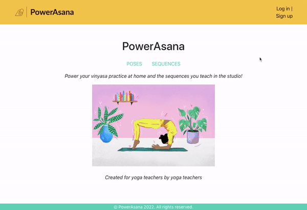
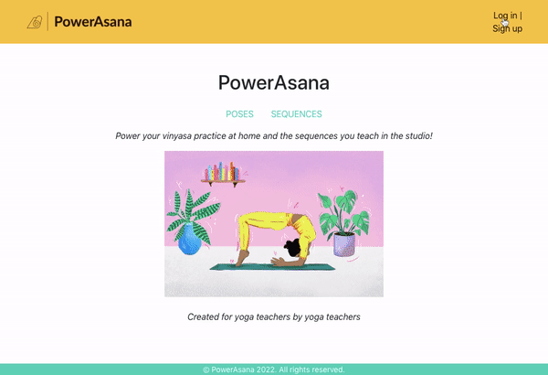
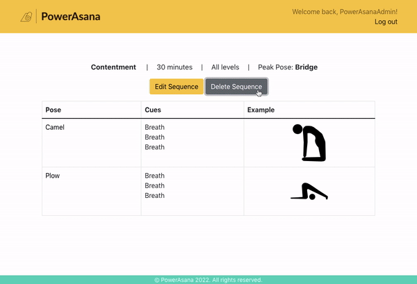
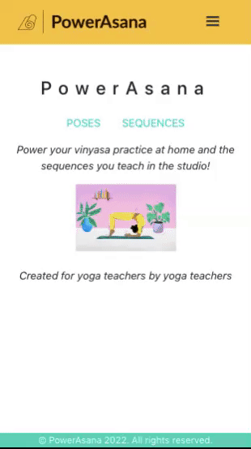

# PowerAsana Frontend 
________________________

**Project Description**
The frontend of a power vinyasa yoga app made for practitioners at home and yoga teachers looking for sequence inspiration and a place to store their personalized sequences.

**Link to Deployed Application**
[Live version of PowerAsana App](https://powerasana.netlify.app/)

**Technologies Used**
React, HTML, CSS3, Bootstrap, Javascript, Django, Python

**Examples Application Functionality**

**Unsolved Problems**
Currently, users are able to update all aspects of a sequence they are the author for, except poses. They can add poses to an already submitted sequence, but cannot delete or change already submitted poses. 

Additionally, when users create sequences, the poses push to an array. After submission, that array automatically sorts rather than keeping each pose id at the index it was submitted at. 

Periodically, the author for a sequence created on the front end automatically assigns to PowerAsanaAdmin instead of the author signed in.

**Link to Backend Materials**
[Backend Live API](https://powerasana.herokuapp.com/poses)
**There is no home page for the API, see /poses and /sequences for lists of pose and sequence data.
[Backend GitHub](https://github.com/bbkc27/powerasana-backend)

**Installation Instructions**
1. Fork and clone this repository
2. Install required packages using <code>npm i</code>
3. Run the backend API by checking the deployed live API link above 
4. Test the app functionality by running <code>npm start</code>

**Source Citations**
- [Yoga Icons](https://thenounproject.com/search/icons/?iconspage=1&q=yoga)
- [Hamburger Menu Helper](https://github.com/negomi/react-burger-menu)
- [React Bootstrap](https://react-bootstrap.netlify.app/)